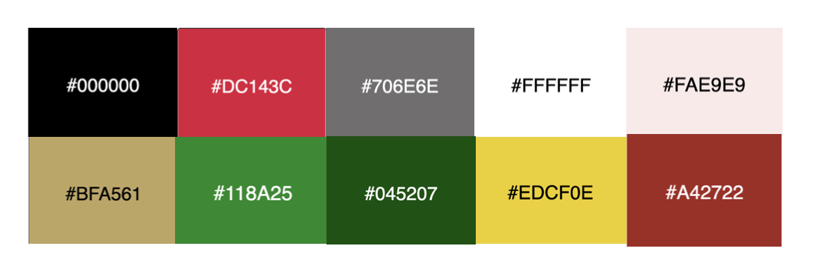

# The Pursuit of Happyness
Welcome to the  website for "The Pursuit of Happyness" film! This website aims to celebrate and provide information about this inspiring and critically acclaimed movie.

"The Pursuit of Happyness" is a biographical drama film directed by Gabriele Muccino, released in 2006. It tells the extraordinary true story of Chris Gardner, a struggling salesman, and his determination to overcome adversity to build a better life for himself and his young son.

Our website serves as a dedicated platform for fans of the film, as well as those who are interested in learning more about its cast, awards, storyline, and reviews. Here, you will find a collection of resources that delve into the various aspects of the movie and provide an interactive experience for visitors.
## The design provided

## Table of contents

- User Stories
- Features
- Technologies Used
- Design
- Wireframes
- Bugs
- Testing
  - Compatibility
  - Validator testing
  - Lighthouse Report
- Deployment
- Author
- Credits
- Acknowledgments
--------------------
similar as possible to the provided images.
I have also added various breakpoints in order to provide the best user experience.

The solution to this challenge can be accessed by this [link](https://jibinjjohny.github.io/projrct_1/)

--------------------

## User Stories

1. As a movie enthusiast, I want to explore the cast section to learn about the actors involved in "The Pursuit of Happyness" and their respective roles.

2. As a fan of the film, I want to know about the major awards won by "The Pursuit of Happyness" to understand its critical acclaim and recognition.

3. As a visitor, I want to read the synopsis and storyline of the movie in the about section to gain an overview of the film's central theme and narrative.

4. As a passionate viewer, I want to share my thoughts and feelings about "The Pursuit of Happyness" by submitting a film review and rating in the review section.

5. As a potential viewer, I want to access social media links available in the footer section to connect with the film's official profiles and stay updated with the latest news and updates.

------------------------

## Technologies Used
- HTML - was used as the foundation of the site.
- CSS - was used to add the styles and layout of the site.

- CSS Grid - was used to make "Cast" section responsive.
- CSS Flex - was used to arrange "Award" section arrange symmetrically on the pages.
- CSS roots - was used to declaring global CSS variables and apply them throughout the project.
- VSCode - was used as the main tool to write and edit code.
- Git - was used for the version control of the website.
- GitHub - was used to host the code of the website.
-----------------------------
## Design

###COLOR SCHEME

This overall color scheme used throughout the site was the variety of colours in the image below.

###FONT FAMILY

[Font Family Lato Regular 400](https://fonts.google.com/specimen/Lato?preview.text=the%20pursuit%20of%20happyness&preview.text_type=custom&query=Lato) was choosen to create this website 

---------------------------

## Wireframes
[Here is the Desktop wireframe](https://github.com/JIBINJJOHNY/projrct_1/blob/main/assets/images/readfile/desktop.jpg)
[Here is the mobile wireframe](https://github.com/JIBINJJOHNY/projrct_1/blob/main/assets/images/readfile/mobile.jpg)

## Features
The following features have been used in this project:

- Hover

    Tells the user solve now,  navabar ,cast images ,award images ,submit button and social media icons are highlighted.
    Mouse pointer changes to a hand to indicate a clickable area.

----------------------------
## Deployment

### INITIAL DEPLOYMENT
This site was deployed using GitHub Pages with the following the steps below:
1. Login or Sign Up to GitHub.
2. Create a new repository named project1.
3. Once created, click on "Settings" on the navigation bar under the repository title.
4. Click on "Pages", on the left hand side below Secrets.
5. Under "Source", choose which branch you wish to deploy, In most cases it will be "main".
6. Choose which folder to deploy from, generally from "/root".
7. Click "Save", then wait for it to be deployed. It may take some time for the page to be fully deployed.
8. The URL will be displayed above the "source" section in GitHub Pages.

### HOW TO FORK A REPOSITORY
If you need to make a copy of a repository:

1. Login or Sign Up to GitHub.
2. On GitHub, go to project1.
In the top right corner, click "Fork".

### HOW TO CLONE A REPOSITORY
If you need to make a clone:

1. Login in to GitHub.
2. Fork the repository project1 using the steps above in How To Fork a Repository.
3. Above the file list, click "Code".
4. Choose if you want to close using HTTPS, SSH or  GitHub CLI, then click the copy button to the right.
5. Open Git Bash.
6. Change the directory to where you want your clone to go.
7. Type git clone and then paste the URL you copied in step 4.
8. Press Enter to create your clone.

### HOW TO MAKE A LOCAL CLONE
If you need to make a local clone:

1. Login in to GitHub.
2. Under the repository name, above the list of files, click "Code".
3. Here you can either Clone or Download the repository.
4. You should close the repository using HTTPS, clicking on the icon to copy the link.
5. Open Git Bash.
6. Change the current working directory to the new locaiton, where you want the cloned directory to be.
7. Type git clone and then paste the URL you copied in step 4.
8. Press Enter, and your local clone will be created.

------------
## Credits

- Lato Regular 400 font-family was imported from [google fonts](https://fonts.google.com/specimen/Lato?preview.text=the%20pursuit%20of%20happyness&preview.text_type=custom&query=Lato).
- Icons were sources from [Font Awesome](https://fontawesome.com/search).
- Home image took from [spirituality practice](https://www.spiritualityandpractice.com/films/reviews/view/16385/the-pursuit-of-happyness).

### Cast Images:
1. [Will Smith](https://www.filmstarts.de/personen/19358.html)
2. [Jaden Smith](https://www.rottentomatoes.com/celebrity/jaden-smith)
3. [Thandiwe Newton](https://www.rottentomatoes.com/celebrity/thandiwe_newton)
4. [Brian Howe](https://www.rottentomatoes.com/celebrity/brian_howe)
5. [Dan Castellaneta](https://aladdin.fandom.com/wiki/Dan_Castellaneta)
6. [Takayo Fisher](https://megogo.net/ru/name/1455591-takayo-fisher.html)
7. [James Karen](https://www.microsoft.com/en-au/store/movies-and-tv)
8. [Kevin West](https://www.imdb.com/name/nm0922182/)
9. [Domenic Bove](https://www.imdb.com/name/nm2044962/)

### Awards Images:

1. [Academy Awards](https://en.wikipedia.org/wiki/Academy_Awards)
2. [Critic's Choice Awards](https://www.criticschoice.com/artwork/)
3. [Screen Actors Guild Awards](https://en.wikipedia.org/wiki/Screen_Actors_Guild_Awards)
4. [BET Awards](https://societyawards.com/gallery/bet-awards-trophy)
5. [NAACP Image Awards](https://societyawards.com/gallery/naacp-image-award)
6. [Golden Globe Awards](https://www.pinterest.com/pin/587930926348902877/)

### Background Images:
1. [About page](https://www.netflix.com/title/70044605)
2. [Review Page](https://www.wallpaperflare.com/the-pursuit-of-happyness-movies-wallpaper-titjo)