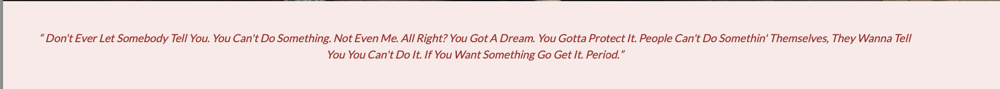
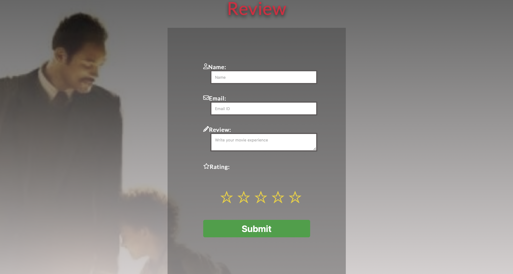

# The Pursuit of Happyness
Welcome to the  website for "The Pursuit of Happyness" film! This website aims to celebrate and provide information about this inspiring and critically acclaimed movie.

"The Pursuit of Happyness" is a biographical drama film directed by Gabriele Muccino, released in 2006. It tells the extraordinary true story of Chris Gardner, a struggling salesman, and his determination to overcome adversity to build a better life for himself and his young son.

Our website serves as a dedicated platform for fans of the film, as well as those who are interested in learning more about its cast, awards, storyline, and reviews. Here, you will find a collection of resources that delve into the various aspects of the movie and provide an interactive experience for visitors.

 The site can be accessed by this [link](https://jibinjjohny.github.io/projrct_1/)

--------------------------------------
## User Stories

1. As a movie enthusiast, I want to explore the cast section to learn about the actors involved in "The Pursuit of Happyness" and their respective roles.

2. As a fan of the film, I want to know about the major awards won by "The Pursuit of Happyness" to understand its critical acclaim and recognition.

3. As a visitor, I want to read the synopsis and storyline of the movie in the about section to gain an overview of the film's central theme and narrative.

4. As a passionate viewer, I want to share my thoughts and feelings about "The Pursuit of Happyness" by submitting a film review and rating in the review section.

5. As a potential viewer, I want to access social media links available in the footer section to connect with the film's official profiles and stay updated with the latest news and updates.
-------------------------

## Features

- ### Navbar

- ##### Navigation
    - Positioned at the top of the page.
    - Contains logo of film on the left side.
    - Contains navigation links on the right side:
      - HOME - leads to the home page where users can have a look at the image of the film.
      - CAST - leads to the cast page, where the user can have a look at the main cast of the film and the name of the character.
      - AWARDS - leads to the awards page, where the user can have a look at the main awards the film has won and its category.
      - ABOUT - leads to the about page, where the user can see an overview of the film.
      - REVIEW -leads to the review form page, where users can share their reviews and ratings of films.
    - The links have animated hover effect.  
    - The navigation is clear and easy to understand for the user.
      - 
    - The navigation bar is responsive with hamburger menu:

      - 
    - When the hamburger menu is clicked, there is dropdown menu with the links in the same order.
      - 

##### Home Page:
   - Represent:
      -  Contains an image from the film.
      - The main actors and actresses who appeared in the film.
      - Contains the notable awards and nominations for the film.
      - Short summary of the film.
      - The famous inspiring quote from the film.
      - Invites to fill out the review form.

      - 

--------------------------------------
##### Hero Section
 - Hero section have a fixed background image.
    - 

##### Cast section
  - The cast section contains the main characters in the film.
  - Tells website visitors the name of the character in the film, along with the cast picture and real name.
  - Images are animated on hover.
    - 

##### Awards

- The Awards section contains the major awards and nominations that the film has received.
- Each of the cards has a picture of an award.
- Each cards are animated on hover.
  -

##### Quotes section
  - Quotes section includes an inspirational quote from the film.
    - 

 ##### Review Section
  - All of the text input fields are customised.

  - All input fields are animated when the input field is in focus.

  - All input fields are set to be required.

  - It has a rating option for the visitors, they can rate the film from 1 to 5 stars.
  - The submit button is animated on hover.

  - The page is responsive on all common screen resolutions.

  - The submit button leads to the response page.
    - 

##### Response page
  - The response page will appear after you submit the review form.
  - It will have a thank you message and notification that your valuable review has been successfully submitted.
  - It includes a "back to homepage" link to return to the homepage.
    - 
##### Footer
  - The footer contains social media links which open in a new tab.
  - All social media links are animated on hover
    - 

----------------------------

## Technologies Used

[HTML](https://developer.mozilla.org/en-US/docs/Web/HTML) -was used as the foundation of the site.
[CSS](https://developer.mozilla.org/en-US/docs/Web/css) -was used to add the styles and layout of the site.
[CSS Grid](https://developer.mozilla.org/en-US/docs/Web/CSS/grid) -was used to make "Cast" section responsive.
[CSS Flex](https://developer.mozilla.org/en-US/docs/Learn/CSS/CSS_layout/Flexbox) - was used to arrange "Award" section arrange symmetrically on the pages.
[CSS roots](https://developer.mozilla.org/en-US/docs/Web/CSS/:root) - was used to declaring global CSS variables and apply them throughout the project.
[Figma](https://www.figma.com/) - was used to make wireframes for the website
[VSCode](https://code.visualstudio.com/) - was used as the main tool to write and edit code.
[Git](https://git-scm.com/) - was used for the version control of the website.
[GitHub](https://github.com/) - was used to host the code of the website.

-----------------------------------

## Design

### Color Scheme

This overall color scheme used throughout the site was the variety of colours in the image below.

-  Red was used for heading it is a highly visible color that naturally draws attention. By using #dc143c for website headings, it helps capture the user's focus and guide their attention to important information or key messages
- Grey was used for the hover effect of the navigation bar and is a neutral colour that can provide a balanced and understated look. It doesn't overwhelm other elements on the site and can create a sense of professionalism and sophistication.
-  Pale pink was a muted colour, it is used for quote backgrounds it can create a soft and delicate visual effect. It evokes a sense of softness.
- The tan color was used for cast image border. It can give a classic and enduring look to the website, ensuring that the design remains relevant and visually appealing over time.
- Medium-dark shade of green, can create a visually striking and attention-grabbing effect for the submit button. It helps draw the user's eye and signals that it is an interactive element to complete an action
- Dark shade of green that offers a strong contrast against lighter backgrounds. When users hover over the submit button, the change to #0b3e0d creates a noticeable visual feedback, indicating that the button is interactive and responsive to user actions.
-  Vibrant shade of yellow. It provides a high contrast against most text colors, making the highlighted paragraphs stand out prominently from the surrounding content. This ensures that the highlighted information catches the reader's attention.
- Rich shade of red. It provides a strong contrast against lighter backgrounds, making the quote text stand out prominently. This high contrast ensures that the quote immediately captures the reader's attention
### Font Family

[Font Family Lato Regular 400](https://fonts.google.com/specimen/Lato?preview.text=the%20pursuit%20of%20happyness&preview.text_type=custom&query=Lato) was choosen to create this website 

---------------------------

## Wireframes
[Here is the Desktop wireframe]()
[Here is the mobile wireframe]()

----------------------------
## Testing
All test related documentation can be found in the [TESTING.md](TESTING.md) file.

----------------------------
## Deployment

- The site has been deployed on GitHub pages. The steps to deploy are as follows:
  - In the [GitHub repository](https://github.com/JIBINJJOHNY/projrct_1), go to the Settings tab.
  - Select **Main** Branch from the Source Section drop-down menu, then click Save.
  - The page will be automatically refreshed with a detailed ribbon display to show that the deployment has been successful.
  - The live link can be found [here](https://jibinjjohny.github.io/projrct_1`).

### Local Deployment
- To create a local copy of this project, you can clone it. In the terminal window of your IDE, type the following command to clone my repository:
  - git clone https://github.com/JIBINJJOHNY/projrct_1.git
  - Alternatively, if you are using Gitpod, you can [click here](https://gitpod.io/new/#https://github.com/JIBINJJOHNY/projrct_1) to launch your Gitpod working environment.

--------------------------------
## Future improvements
- Add image slider to hero image.
- Add sliding text to quotes section.
- Add Video Gallery for offical teaser.
- add custom 404 page.
- Improve commit message quality (I'm a git bigginer, so not all commits meet standards, but will try to improve in future)

--------------------------------
## Credits

- Lato Regular 400 font-family was imported from [google fonts](https://fonts.google.com/specimen/Lato?preview.text=the%20pursuit%20of%20happyness&preview.text_type=custom&query=Lato).
- Icons were sources from [Font Awesome](https://fontawesome.com/search).
- Home image took from [spirituality practice](https://www.spiritualityandpractice.com/films/reviews/view/16385/the-pursuit-of-happyness).
- Inspiration for the responsive hamburger navbar came from [CodingNepal](https://www.youtube.com/@CodingNepal) on his YouTube channel.
- Inspiration for the responsive Star Rating Widget with CSS from [Nevin Katz](https://codepen.io/nevkatz) on website codepen.

### Cast Images:
1. [Will Smith](https://www.filmstarts.de/personen/19358.html)
2. [Jaden Smith](https://www.rottentomatoes.com/celebrity/jaden-smith)
3. [Thandiwe Newton](https://www.rottentomatoes.com/celebrity/thandiwe_newton)
4. [Brian Howe](https://www.rottentomatoes.com/celebrity/brian_howe)
5. [Dan Castellaneta](https://aladdin.fandom.com/wiki/Dan_Castellaneta)
6. [Takayo Fisher](https://megogo.net/ru/name/1455591-takayo-fisher.html)
7. [James Karen](https://www.google.com/search?q=james+karen&rlz=1C5CHFA_enDE951DE951&oq=james&aqs=chrome.2.69i57j69i64j69i59j46i340i512j46i512j69i60l3.4257j0j7&sourceid=chrome&ie=UTF-8#vhid=NFUhgS8wE5UocM&vssid=l)
8. [Kevin West](https://www.imdb.com/name/nm0922182/)
9. [Domenic Bove](https://www.imdb.com/name/nm2044962/)

### Awards Images:

1. [Academy Awards](https://en.wikipedia.org/wiki/Academy_Awards)
2. [Critic's Choice Awards](https://www.criticschoice.com/artwork/)
3. [Screen Actors Guild Awards](https://en.wikipedia.org/wiki/Screen_Actors_Guild_Awards)
4. [BET Awards](https://societyawards.com/gallery/bet-awards-trophy)
5. [NAACP Image Awards](https://societyawards.com/gallery/naacp-image-award)
6. [Golden Globe Awards](https://www.pinterest.com/pin/587930926348902877/)

### Background Images:
1. [Cast & Awards pages](https://unsplash.com/photos/78uNJt1kPw8)
2. [About page](https://www.netflix.com/title/70044605)
3. [Review Page](https://www.wallpaperflare.com/the-pursuit-of-happyness-movies-wallpaper-titjo)

### Tools
- [Figma](https://www.figma.com/) was used to create the logo.
- [tiny png](https://tinypng.com/) was used to resize the size of images.
- [RGBA Color Picker](https://rgbacolorpicker.com/) was used to select suitable color for background.
-----------------------
## Acknowledgments
- [Iuliia Konovalova](https://github.com/IuliiaKonovalova) my mentor has been a great supporter, guiding me through the development of the project and helping me to learn a lot of new things by challenging me to do something new.
- [Code Institute](https://codeinstitute.net/de/)  tutors and Slack community members for their support and help.
- [Kevin Powell](https://www.youtube.com/@KevinPowell) for his html and CSS tutorials.
- [Mr. Web Designer](https://www.youtube.com/@MrWebDesignerAnas) for his html and CSS tutorials.